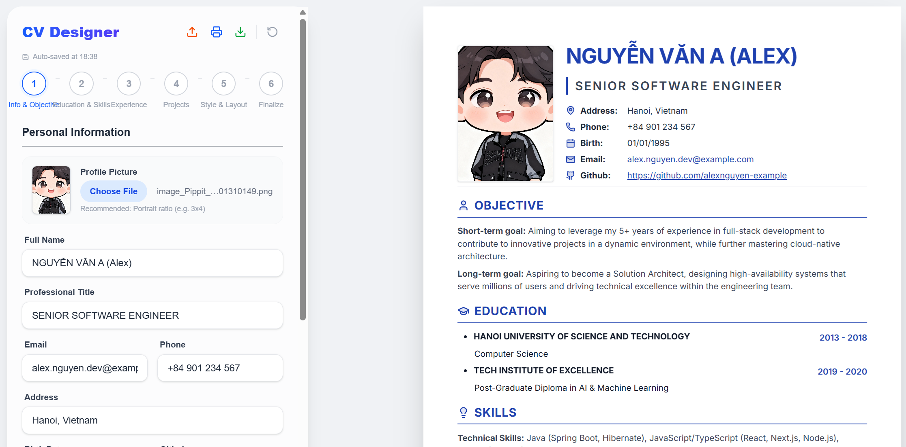

# ✨ CV Generator

<p align="center">
  
  
  
  
</p>

<p align="center">
  
</p>

---

<a id="toc"></a>

## 📑 Mục lục | Table of Contents

<details open>
<summary><b>🇻🇳 Tiếng Việt</b></summary>

- [Giới thiệu](#vi-intro)
- [Tính năng nổi bật](#vi-features)
- [Công nghệ sử dụng](#vi-tech)
- [Cài đặt & Khởi chạy](#setup)
- [Tác giả](#credits)
</details>

<details>
<summary><b>🇺🇸 English</b></summary>

- [Introduction](#en-intro)
- [Key Features](#en-features)
- [Tech Stack](#en-tech)
- [Setup & Getting Started](#setup)
- [Credits](#credits)
</details>

---

<a id="vi-intro"></a>

## 🇻🇳 TIẾNG VIỆT

> 🚀 **Tạo CV chuyên nghiệp trong 5 phút — Không cần kỹ năng thiết kế.**

---

### 😩 Vấn đề bạn từng gặp phải?

- Dành **hàng giờ** chỉnh sửa CV trên Word, nhưng layout **vỡ tan** khi in hoặc gửi đi?
- Copy template online rồi phát hiện **font chữ lộn xộn**, màu sắc không đồng nhất?
- Muốn một bản CV **thực sự nổi bật** nhưng không biết bắt đầu từ đâu?

### ✅ CV Generator — Giải pháp dành cho bạn!

**CV Generator** là công cụ tạo CV trực tuyến **miễn phí**, **mã nguồn mở**, được xây dựng trên nền tảng công nghệ **2025** mới nhất. Chỉ cần nhập thông tin → chỉnh sửa trực quan → xuất PDF hoàn hảo. **Đơn giản. Nhanh chóng. Chuyên nghiệp.**

> 📊 **1 Click = PDF hoàn hảo** | **0 Phí** | **100% Mã nguồn mở**

<a id="vi-features"></a>

### 🌟 Tính năng nổi bật

- 💎 **Giao diện Minimalist:** Thiết kế tinh tế, tập trung vào trải nghiệm người dùng.
- ✍️ **Soạn thảo Tiptap:** Trình chỉnh sửa văn bản giàu tính năng (Rich Text) tích hợp sâu.
- 🖼️ **Cắt ảnh thông minh:** Hỗ trợ cắt avatar ngay trên trình duyệt với `react-easy-crop`.
- ⚡ **Tương tác mượt mà:** Hiệu ứng chuyển cảnh sống động nhờ `framer-motion`.
- 🖨️ **Xuất PDF chuẩn:** Đảm bảo định dạng chính xác khi in hoặc lưu file.
- 💾 **Lưu trữ cục bộ:** Dữ liệu được bảo mật và lưu tự động trên Local Storage.

<a id="vi-tech"></a>

### 🛠️ Công nghệ sử dụng

- **Core:** Next.js 15 (App Router), React 19.
- **Styling:** Tailwind CSS v4 (Modern Engine).
- **Editor:** Tiptap & Jodit.
- **Animation:** Framer Motion.
- **Icons:** Lucide React.

---

<a id="en-intro"></a>

## 🇺🇸 ENGLISH

> 🚀 **Create a professional CV in 5 minutes — No design skills required.**

---

### 😩 Sound familiar?

- Spent **hours** tweaking your CV in Word, only for the layout to **break** when printing or sharing?
- Downloaded a template online and ended up with **messy fonts** and inconsistent colors?
- Wanted a CV that **truly stands out** but didn't know where to start?

### ✅ CV Generator — Your solution is here!

**CV Generator** is a **free**, **open-source** online CV builder, crafted with the **latest 2025 technologies**. Just enter your info → edit visually → export a pixel-perfect PDF. **Simple. Fast. Professional.**

> 📊 **1 Click = Perfect PDF** | **$0 Cost** | **100% Open Source**

<a id="en-features"></a>

### 🌟 Key Features

- 💎 **Minimalist UI:** Sleek and focused design for the best user experience.
- ✍️ **Tiptap Powered:** Integrated modern Rich Text editor for fully customizable sections.
- 🖼️ **Smart Image Cropping:** Seamlessly adjust your profile picture with `react-easy-crop`.
- ⚡ **Fluid Animations:** Smooth transitions and micro-interactions via `framer-motion`.
- 🖨️ **Perfect PDF Export:** High-fidelity print support to ensure your CV looks great on paper.
- 💾 **Auto-save:** Your data is securely stored in Local Storage for persistent editing.

<a id="en-tech"></a>

### 🛠️ Tech Stack

- **Core:** Next.js 15 (App Router), React 19.
- **Styling:** Tailwind CSS v4.
- **Editor:** Tiptap & Jodit.
- **Animation:** Framer Motion.
- **Icons:** Lucide React.

---

<a id="setup"></a>

## 🚀 Cài đặt & Khởi chạy | Setup & Getting Started

### 1. Clone dự án | Clone the repository

```bash
git clone https://github.com/philau2512/cv-generator.git
cd cv-generator
```

### 2. Cài đặt thư viện | Install dependencies

```bash
npm install
# or
pnpm install
```

### 3. Chạy môi trường Dev | Start dev server

```bash
npm run dev
```

Truy cập [http://localhost:3000](http://localhost:3000) để bắt đầu xây dựng sự nghiệp của bạn!

---

<a id="credits"></a>

## ❤️ Credits

- **🇻🇳 Tiếng Việt:** Dự án được phát triển bởi **Phi Lau Dev**. Nếu bạn thấy dự án hữu ích, hãy tặng một ⭐ nhé!
- **🇺🇸 English:** This project is developed by **Phi Lau Dev**. If you find this project useful, please give it a ⭐!

<p align="center">
  <i>"Your career, beautifully organized."</i>
</p>
